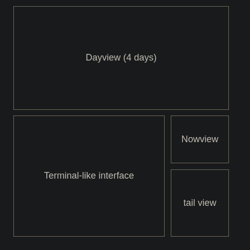

# SolidJS Frontend Implementation Plan

> **Instructions for AI implementers:**
>
> 1. Use the commit status markers to track progress through the implementation:
>    - `STATUS: NOT STARTED` - Work has not begun yet
>    - `STATUS: IN PROGRESS` - Work is currently underway
>    - `STATUS: COMPLETED` - Work is finished
>    - `STATUS: BLOCKED` - Work is blocked by another task
>
> 2. For each commit, add detailed implementation notes in the commit section, documenting:
>    - Key decisions made during implementation
>    - Any deviations from the original plan and why
>    - Challenges encountered and their solutions
>    - Potential optimizations or improvements for the future
>
> 3. Review and refine future steps based on what you learn from earlier implementations.
> 4. Use test driven development where appropriate, writing tests/interface first before writing the implementation.
> 5. Each commit should be focused, self-contained, and include appropriate tests.
> 6. Keep this plan updated as implementation progresses.

## Overview
This plan outlines the approach for implementing a SolidJS-based frontend for the Datum CLI application. The frontend will provide a browser-based interface while maintaining the local-first principles of the application.

## Architecture

### Directory Structure
```
/frontend
├── public/
│   ├── index.html               # Entry HTML file
│   └── favicon.ico              # Site favicon
├── src/
│   ├── App.tsx                  # Main application component
│   ├── index.tsx                # Entry point
│   ├── components/              # Reusable UI components
│   │   ├── Layout/              # Layout components
│   │   │   ├── AppLayout.tsx    # Main application layout
│   │   │   └── Panel.tsx        # Reusable panel component
│   │   ├── Terminal/            # Terminal-like interface
│   │   │   ├── Terminal.tsx     # Terminal container component
│   │   │   ├── TerminalInput.tsx # Command input component
│   │   │   └── TerminalOutput.tsx # Command output display
│   │   ├── DayView/             # 4-day dayview panel
│   │   │   ├── DayView.tsx      # DayView container
│   │   │   └── SVGRenderer.tsx  # Component to render SVG output
│   │   ├── NowView/             # Nowview panel
│   │   │   ├── NowView.tsx      # NowView container
│   │   │   └── SVGRenderer.tsx  # Component to render SVG output
│   │   ├── TailView/            # Tail view panel
│   │   │   └── TailView.tsx     # TailView container
│   │   └── SyncPopup/           # CouchDB sync popup
│   │       ├── SyncPopup.tsx    # Sync configuration modal
│   │       └── CredentialForm.tsx # Form for entering sync credentials
│   ├── hooks/                   # Custom hooks
│   │   ├── useTerminal.ts       # Terminal state and command processing
│   │   ├── useCommandHistory.ts # Command history management
│   │   ├── useDayView.ts        # DayView state and rendering
│   │   ├── useNowView.ts        # NowView state and rendering
│   │   ├── useTailView.ts       # TailView state and rendering
│   │   └── useDb.ts             # Database connection and management
│   ├── utils/                   # Utility functions
│   │   ├── commandRunner.ts     # Runs commands via datum()
│   │   ├── svgUtils.ts          # Utilities for SVG handling
│   │   ├── credentialStorage.ts # Secure credential storage
│   │   └── dbUtils.ts           # Database utilities
│   ├── context/                 # React context providers
│   │   ├── DbContext.tsx        # Database context provider
│   │   └── CommandContext.tsx   # Command processing context
│   └── styles/                  # Styling
│       ├── global.css           # Global styles
│       ├── layout.css           # Layout styles
│       └── themes.css           # Theme definitions
├── vite.config.ts               # Vite configuration
├── tsconfig.json                # TypeScript configuration
└── package.json                 # Frontend package configuration
```

### Integration with Existing CLI

To integrate with the existing CLI codebase, we'll:

1. **Command Integration**: Directly call `datum()` from mainArgs.ts to handle command processing
2. **Database Connection**: Use the existing connectDbBrowser.ts implementation for browser contexts
3. **Rendering**: Render SVG outputs directly in the browser (with potential for direct D3 integration in the future)

## Core Code Changes Required

Before implementing the frontend, several changes are needed in the core codebase to make it browser-compatible and suitable for integration. The following changes should be implemented as a series of focused commits.

## Implementation Checklist

This section provides a detailed commit-by-commit breakdown for implementing the necessary changes. Each commit has a status marker to track progress, and should include detailed implementation notes after completion.

### Core Code Changes

#### Commit 1: Create Output Interface
**STATUS: NOT STARTED**

**Purpose:** Create a foundation for browser-compatible output handling

**Tasks:**
- [ ] Create a new interface in `/src/output/outputInterface.ts` that defines methods for different output types
- [ ] Implement a console output provider that matches the current behavior
- [ ] Add infrastructure for a browser output provider
- [ ] Add tests for the new interface

**Files to modify:**
- Create new file: `/src/output/outputInterface.ts`
- Create new file: `/src/output/consoleOutput.ts`
- Create new file: `/src/output/browserOutput.ts` (skeleton)

**Implementation Notes:**
<!-- Add detailed implementation notes here after completion -->

#### Commit 2: Refactor Output Main Functions
**STATUS: NOT STARTED**

**Purpose:** Modify core output functions to use the interface

**Tasks:**
- [ ] Refactor `showSingle()`, `showHeaderLine()`, and `showMainInfoLine()` in output.ts
- [ ] Make functions return formatted strings and accept an output provider
- [ ] Ensure backward compatibility with console output
- [ ] Update tests for refactored functions

**Files to modify:**
- `/src/output/output.ts`

**Implementation Notes:**
<!-- Add detailed implementation notes here after completion -->

#### Commit 3: Refactor Secondary Output Functions
**STATUS: NOT STARTED**

**Purpose:** Complete the output system refactoring

**Tasks:**
- [ ] Refactor remaining output functions (`showCreate()`, `showExists()`, etc.)
- [ ] Update all functions to use the new output interface
- [ ] Add unit tests for the new output system
- [ ] Ensure all output-related tests pass

**Files to modify:**
- `/src/output/output.ts`
- Create/update test files as needed

**Implementation Notes:**
<!-- Add detailed implementation notes here after completion -->

#### Commit 4: Update DayView Command
**STATUS: NOT STARTED**

**Purpose:** Make dayview command browser-compatible

**Tasks:**
- [ ] Modify `dayviewCmd.ts` to use the output interface
- [ ] Ensure proper SVG string return
- [ ] Remove direct console.log calls
- [ ] Add/update tests for browser compatibility

**Files to modify:**
- `/src/commands/dayviewCmd.ts`

**Implementation Notes:**
<!-- Add detailed implementation notes here after completion -->

#### Commit 5: Update NowView Command
**STATUS: NOT STARTED**

**Purpose:** Make nowview command browser-compatible

**Tasks:**
- [ ] Modify `nowviewCmd.ts` to use the output interface
- [ ] Ensure proper SVG string return
- [ ] Remove direct console.log calls
- [ ] Add/update tests for browser compatibility

**Files to modify:**
- `/src/commands/nowviewCmd.ts`

**Implementation Notes:**
<!-- Add detailed implementation notes here after completion -->

#### Commit 6: Update Tail Command
**STATUS: NOT STARTED**

**Purpose:** Make tail command browser-compatible

**Tasks:**
- [ ] Modify `tailCmd.ts` to use the output interface
- [ ] Return formatted output strings instead of console.log
- [ ] Support both browser and console modes
- [ ] Add/update tests for both modes

**Files to modify:**
- `/src/commands/tailCmd.ts`

**Implementation Notes:**
<!-- Add detailed implementation notes here after completion -->

#### Commit 7: Improve Error Handling
**STATUS: NOT STARTED**

**Purpose:** Replace process.exit() with structured errors

**Tasks:**
- [ ] Create structured error classes in `/src/errors/browserCompatibleErrors.ts`
- [ ] Replace process.exit() calls with proper error throwing
- [ ] Ensure errors can be displayed in browser context
- [ ] Add tests for error handling

**Files to modify:**
- Create new file: `/src/errors/browserCompatibleErrors.ts`
- `/src/index.ts`
- `/src/input/mainArgs.ts`

**Implementation Notes:**
<!-- Add detailed implementation notes here after completion -->

#### Commit 8: Update Main Command Interface
**STATUS: NOT STARTED**

**Purpose:** Make datum() function browser-compatible

**Tasks:**
- [ ] Modify `datum()` function to return structured output
- [ ] Add support for different output types (console/browser)
- [ ] Create browser-specific version if needed
- [ ] Add tests for the updated interface

**Files to modify:**
- `/src/input/mainArgs.ts`

**Implementation Notes:**
<!-- Add detailed implementation notes here after completion -->

#### Commit 9: Browser-Compatible Database Connection
**STATUS: NOT STARTED**

**Purpose:** Ensure database connection works in browser environment

**Tasks:**
- [ ] Update `connectDbBrowser.ts` to ensure browser compatibility
- [ ] Add credential storage and sync configuration support
- [ ] Add reconnection logic for browser environment
- [ ] Add tests for browser database connection

**Files to modify:**
- `/src/auth/connectDbBrowser.ts`
- Create new file: `/src/auth/credentialStorage.ts`

**Implementation Notes:**
<!-- Add detailed implementation notes here after completion -->

#### Commit 10: Integration Tests
**STATUS: NOT STARTED**

**Purpose:** Verify the changes work correctly in a browser-like environment

**Tasks:**
- [ ] Add integration tests for browser-compatible interfaces
- [ ] Test output formatting, error handling, and command execution
- [ ] Mock browser environment for testing
- [ ] Ensure all integration tests pass

**Files to modify:**
- Create new test files as needed

**Implementation Notes:**
<!-- Add detailed implementation notes here after completion -->

### Detailed Changes Description

#### 1. Output Handling Refactoring

- `/src/output/outputInterface.ts`:
  - Define interfaces for different output types (text, structured, SVG)
  - Create methods for different output scenarios (info, error, warning)
  - Support both console and browser outputs

- `/src/output/output.ts`:
  - Refactor functions to return strings/structured data instead of using console.log
  - Modify `showSingle()`, `showCreate()`, `showHeaderLine()`, `showMainInfoLine()` to return formatted strings
  - Add output provider parameter to functions

- `/src/commands/dayviewCmd.ts` and `/src/commands/nowviewCmd.ts`:
  - Ensure SVG output is properly returned as a string (already partially implemented)
  - Remove direct console.log calls and use the output interface

- `/src/commands/tailCmd.ts`:
  - Refactor to return formatted output through the output interface

#### 2. Error Handling Improvements

- `/src/errors/browserCompatibleErrors.ts`:
  - Create structured error classes for different error types
  - Include additional metadata needed for display in browser

- `/src/index.ts` and `/src/input/mainArgs.ts`:
  - Replace process.exit() calls with proper error throwing
  - Use the new error classes for structured error handling

#### 3. Command Interface Modifications

- `/src/input/mainArgs.ts`:
  - Update the `datum()` function to return structured output
  - Add parameters for output providers
  - Create helper functions for browser-specific handling

#### 4. Database Connection Updates

- `/src/auth/connectDbBrowser.ts`:
  - Verify browser compatibility of dependencies
  - Update imports as needed

- `/src/auth/credentialStorage.ts`:
  - Implement secure credential storage
  - Add sync configuration handling

## Frontend Implementation

After the core code changes are completed, proceed with implementing the frontend itself. Each commit should include implementation notes and a status marker to track progress.

#### Commit 11: Initialize Frontend Project
**STATUS: NOT STARTED**

**Purpose:** Set up the basic SolidJS project structure

**Tasks:**
- [ ] Set up the SolidJS project structure with Vite
- [ ] Add required dependencies to the frontend package.json
- [ ] Configure TypeScript settings for compatibility with the main project
- [ ] Create basic build scripts

**Files to create/modify:**
- `/frontend/package.json`
- `/frontend/vite.config.ts`
- `/frontend/tsconfig.json`
- `/frontend/src/index.tsx`
- `/frontend/src/App.tsx`

**Implementation Notes:**
<!-- Add detailed implementation notes here after completion -->

#### Commit 12: Configure Build System
**STATUS: NOT STARTED**

**Purpose:** Set up the build system for development and deployment

**Tasks:**
- [ ] Set up build system for bundling the datum core code
- [ ] Configure GitHub Pages deployment workflow
- [ ] Add basic project documentation
- [ ] Test build process

**Files to create/modify:**
- `/frontend/.github/workflows/deploy.yml`
- `/frontend/vite.config.ts` (updates)
- `/frontend/README.md`

**Implementation Notes:**
<!-- Add detailed implementation notes here after completion -->

#### Commit 13: Create Application Shell
**STATUS: NOT STARTED**

**Purpose:** Implement the basic application layout

**Tasks:**
- [ ] Implement the base application layout
- [ ] Create container components for the main panels
- [ ] Set up the basic CSS structure
- [ ] Implement theme variables and basic styling

**Files to create/modify:**
- `/frontend/src/components/Layout/AppLayout.tsx`
- `/frontend/src/components/Layout/Panel.tsx`
- `/frontend/src/styles/global.css`
- `/frontend/src/styles/layout.css`
- `/frontend/src/styles/themes.css`

**Implementation Notes:**
<!-- Add detailed implementation notes here after completion -->

#### Commit 14: Set up Core Integrations
**STATUS: NOT STARTED**

**Purpose:** Set up the integration with the core code

**Tasks:**
- [ ] Set up initial imports from the core code
- [ ] Configure module aliases
- [ ] Add basic tests for integration with core code
- [ ] Create import/export module for core code

**Files to create/modify:**
- `/frontend/src/core/index.ts`
- `/frontend/vite.config.ts` (updates for aliases)
- `/frontend/src/__tests__/core-integration.test.ts`

**Implementation Notes:**
<!-- Add detailed implementation notes here after completion -->

#### Commit 15: Database Connection
**STATUS: NOT STARTED**

**Purpose:** Implement the database connection functionality

**Tasks:**
- [ ] Implement PouchDB connection using the existing connectDbBrowser functionality
- [ ] Set up database context provider for application-wide access
- [ ] Add connection status indicators
- [ ] Implement basic error handling for database operations

**Files to create/modify:**
- `/frontend/src/hooks/useDb.ts`
- `/frontend/src/context/DbContext.tsx`
- `/frontend/src/components/StatusIndicator.tsx`

**Implementation Notes:**
<!-- Add detailed implementation notes here after completion -->

#### Commit 16: Terminal Interface - Input
**STATUS: NOT STARTED**

**Purpose:** Create the terminal input component

**Tasks:**
- [ ] Create the terminal input component with command history support
- [ ] Implement keyboard navigation (up/down arrows for history)
- [ ] Add input focus management
- [ ] Style the terminal input to match the wireframe

**Files to create/modify:**
- `/frontend/src/components/Terminal/Terminal.tsx`
- `/frontend/src/components/Terminal/TerminalInput.tsx`
- `/frontend/src/hooks/useCommandHistory.ts`
- `/frontend/src/styles/terminal.css`

**Implementation Notes:**
<!-- Add detailed implementation notes here after completion -->

#### Commit 17: Terminal Interface - Output
**STATUS: NOT STARTED**

**Purpose:** Implement the terminal output display

**Tasks:**
- [ ] Implement terminal output display component
- [ ] Add support for different output types (text, structured, SVG)
- [ ] Implement inline error handling in the terminal output
- [ ] Style the terminal output to match the wireframe

**Files to create/modify:**
- `/frontend/src/components/Terminal/TerminalOutput.tsx`
- `/frontend/src/utils/outputFormatters.ts`

**Implementation Notes:**
<!-- Add detailed implementation notes here after completion -->

#### Commit 18: Command Processing
**STATUS: NOT STARTED**

**Purpose:** Implement command execution and processing

**Tasks:**
- [ ] Implement command processing by directly calling `datum()` from mainArgs.ts
- [ ] Create command context provider
- [ ] Add command execution feedback
- [ ] Implement error handling for command execution

**Files to create/modify:**
- `/frontend/src/utils/commandRunner.ts`
- `/frontend/src/context/CommandContext.tsx`
- `/frontend/src/hooks/useTerminal.ts`

**Implementation Notes:**
<!-- Add detailed implementation notes here after completion -->

#### Commit 19: SVG Renderer Component
**STATUS: NOT STARTED**

**Purpose:** Create a reusable SVG renderer

**Tasks:**
- [ ] Create reusable SVG renderer component
- [ ] Add support for rendering SVG strings
- [ ] Implement proper SVG sizing and responsiveness
- [ ] Add error handling for SVG rendering issues

**Files to create/modify:**
- `/frontend/src/components/SVGRenderer.tsx`
- `/frontend/src/utils/svgUtils.ts`

**Implementation Notes:**
<!-- Add detailed implementation notes here after completion -->

#### Commit 20: DayView Panel
**STATUS: NOT STARTED**

**Purpose:** Implement the 4-day dayview panel

**Tasks:**
- [ ] Implement the 4-day dayview panel component
- [ ] Integrate with dayviewCmd to get SVG output
- [ ] Add refresh/reload functionality
- [ ] Style to match the wireframe design

**Files to create/modify:**
- `/frontend/src/components/DayView/DayView.tsx`
- `/frontend/src/hooks/useDayView.ts`

**Implementation Notes:**
<!-- Add detailed implementation notes here after completion -->

#### Commit 21: NowView Panel
**STATUS: NOT STARTED**

**Purpose:** Implement the nowview panel

**Tasks:**
- [ ] Implement the nowview panel component
- [ ] Integrate with nowviewCmd to get SVG output
- [ ] Add auto-refresh functionality
- [ ] Style to match the wireframe design

**Files to create/modify:**
- `/frontend/src/components/NowView/NowView.tsx`
- `/frontend/src/hooks/useNowView.ts`

**Implementation Notes:**
<!-- Add detailed implementation notes here after completion -->

#### Commit 22: TailView Component
**STATUS: NOT STARTED**

**Purpose:** Implement the tail view component

**Tasks:**
- [ ] Implement the tail view component
- [ ] Integrate with tailCmd for content
- [ ] Add auto-update functionality
- [ ] Style to match the wireframe design
- [ ] Ensure proper scrolling and overflow behavior

**Files to create/modify:**
- `/frontend/src/components/TailView/TailView.tsx`
- `/frontend/src/hooks/useTailView.ts`

**Implementation Notes:**
<!-- Add detailed implementation notes here after completion -->

#### Commit 23: Layout Integration
**STATUS: NOT STARTED**

**Purpose:** Integrate all panels into the final layout

**Tasks:**
- [ ] Integrate all panels into the final layout
- [ ] Ensure proper sizing and spacing between panels
- [ ] Implement responsive behavior for different screen sizes
- [ ] Add loading states for all components

**Files to create/modify:**
- `/frontend/src/App.tsx` (updates)
- `/frontend/src/components/Layout/AppLayout.tsx` (updates)
- `/frontend/src/components/LoadingState.tsx`

**Implementation Notes:**
<!-- Add detailed implementation notes here after completion -->

#### Commit 24: CouchDB Sync Configuration
**STATUS: NOT STARTED**

**Purpose:** Create the CouchDB sync configuration popup

**Tasks:**
- [ ] Create the CouchDB sync configuration popup component
- [ ] Implement credential form with validation
- [ ] Add secure credential storage using the browser's storage APIs
- [ ] Add connection testing functionality

**Files to create/modify:**
- `/frontend/src/components/SyncPopup/SyncPopup.tsx`
- `/frontend/src/components/SyncPopup/CredentialForm.tsx`
- `/frontend/src/utils/credentialStorage.ts`

**Implementation Notes:**
<!-- Add detailed implementation notes here after completion -->

#### Commit 25: Automatic Reconnection
**STATUS: NOT STARTED**

**Purpose:** Implement automatic database reconnection

**Tasks:**
- [ ] Implement automatic reconnection to avoid re-entering credentials
- [ ] Add sync status indicators
- [ ] Implement graceful handling of connection failures
- [ ] Add offline mode detection and notification

**Files to create/modify:**
- `/frontend/src/hooks/useDb.ts` (updates)
- `/frontend/src/components/ConnectionStatus.tsx`

**Implementation Notes:**
<!-- Add detailed implementation notes here after completion -->

#### Commit 26: Final Refinements
**STATUS: NOT STARTED**

**Purpose:** Final polish and refinements

**Tasks:**
- [ ] Optimize for performance
- [ ] Add comprehensive error handling
- [ ] Implement loading states for all operations
- [ ] Add final styling touches
- [ ] Complete documentation

**Files to create/modify:**
- Various files throughout the codebase
- `/frontend/README.md` (updates)

**Implementation Notes:**
<!-- Add detailed implementation notes here after completion -->

#### Commit 27: Build System Finalization
**STATUS: NOT STARTED**

**Purpose:** Finalize the build system for production

**Tasks:**
- [ ] Optimize bundle sizes
- [ ] Configure production builds
- [ ] Ensure proper code splitting
- [ ] Set up comprehensive build scripts

**Files to create/modify:**
- `/frontend/vite.config.ts` (updates)
- `/frontend/package.json` (updates)

**Implementation Notes:**
<!-- Add detailed implementation notes here after completion -->

#### Commit 28: GitHub Pages Deployment
**STATUS: NOT STARTED**

**Purpose:** Set up and verify GitHub Pages deployment

**Tasks:**
- [ ] Configure GitHub Pages deployment workflow
- [ ] Test deployment
- [ ] Add deployment documentation
- [ ] Verify the application works correctly when deployed

**Files to create/modify:**
- `/frontend/.github/workflows/deploy.yml` (updates)
- `/frontend/README.md` (updates)

**Implementation Notes:**
<!-- Add detailed implementation notes here after completion -->

## Technical Considerations

### Browser Compatibility
- Ensure compatibility with modern browsers (Chrome, Firefox, Safari, Edge)
- Use progressive enhancement where possible

### State Management
- Use SolidJS's fine-grained reactivity for state management
- Create a central store for application state
- Use context providers for shared state

### Performance Optimization
- Implement virtualization for large datasets in views
- Use lazy loading for components when appropriate
- Optimize rendering cycles

### Styling Approach
- Use CSS modules for component-specific styling
- Implement a clean, dense UI with minimal spacing
- Use responsive design principles
- Follow existing application color schemes

## Integration Points

### Database Integration
- Use connectDb with pouchdb-browser to establish connections
- Implement sync functionality with remote CouchDB servers
- Handle offline/online states appropriately

### Command Integration
- Map CLI commands to browser-compatible functions
- Ensure proper error handling for browser context
- Create virtual console output for command results

## UI Wireframe

The following wireframe demonstrates the desired UI layout:



The interface should be clean but dense, with minimal gaps between the panels, filling almost the entire viewport.

## Clarified Requirements

Based on discussions with the project owner:

1. **CLI Integration**: The frontend should integrate directly with the CLI code by calling `datum()` from mainArgs.ts.

2. **Command Handling**: For commands requiring Node.js APIs not available in browsers, we'll initially ignore this constraint and focus on implementing the interface.

3. **Database Connection**: We'll use the existing connectDbBrowser.ts implementation.

4. **View Rendering**: SVG outputs from dayview/nowview will be rendered directly in the browser. In the future, direct D3 integration may be implemented for better handling of data changes.

5. **Browser Compatibility**: No specific requirements; targeting modern browsers is sufficient.

6. **Build System**: The frontend will have its own build system separate from the main CLI.

7. **Authentication**: For CouchDB synchronization, users will provide host, username, and password. These credentials should be securely stored to avoid re-entering upon refresh.

8. **Terminal Features**: The terminal interface should support command history (accessible with up/down arrow keys). Command auto-completion is not required for the initial implementation.

9. **Layout Configuration**: Initially, the layout will be fixed without user configuration options for resizing or showing/hiding panels.

10. **Error Handling**: Errors should be displayed inline in the terminal output, consistent with CLI behavior.

11. **Keyboard Shortcuts**: No specific keyboard shortcuts required for the initial implementation.

12. **Offline/Online Transitions**: PouchDB will handle offline/online transitions for syncing. The application should leverage this built-in capability.

13. **Performance Considerations**: No specific performance optimizations needed for large datasets in the initial implementation.

14. **Data Visualization**: Initial implementation will only use the SVG rendering without additional data visualization capabilities.

## Additional Clarifications

Based on further discussions with the project owner:

1. **Command Auto-completion**: Not required for the initial implementation, only command history support is needed.

2. **Offline-First Architecture**: PouchDB already handles the offline-first approach with local storage and remote sync, so no additional implementation is needed for this feature.

3. **Browser Compatibility**: Target modern browsers only; no need to support older browsers or implement complex compatibility solutions.

4. **Build System**: The frontend build system should be completely separate from the main project, but should bundle the datum core code appropriately.

5. **Accessibility**: No specific accessibility requirements for the initial implementation.

6. **Analytics/Telemetry**: No analytics or telemetry should be included in the frontend.

7. **Data Export**: No specific data export functionality is required in the initial implementation.

8. **Deployment**: The application should be easy to deploy to GitHub Pages, with appropriate build scripts and documentation.

## Testing Strategy

### Unit Tests
- Test individual components and hooks
- Mock command interfaces and database connections

### Integration Tests
- Test interactions between components
- Test command processing workflow

### End-to-End Tests
- Test full user journeys
- Test synchronization capabilities

## Build and Deployment Strategy (Commits 17-18)

### Commit 17: Build System Finalization
- Finalize the independent build system using Vite
- Optimize bundle sizes
- Configure production builds
- Ensure proper code splitting
- Set up comprehensive build scripts

**Build System Details:**
- Use Vite for fast development and optimized production builds
- Configure TypeScript settings to ensure compatibility with the main project
- Bundle the datum core code appropriately for browser use
- Implement tree-shaking for smaller bundle sizes
- Configure environment variables for different deployment environments

### Commit 18: Deployment Configuration
- Set up GitHub Pages deployment workflow
- Create deployment documentation
- Implement offline capabilities
- Add final tests for deployed application

**Deployment Details:**
- Configure static file serving for the built frontend
- Create GitHub Actions workflow for automated deployments
- Document deployment process in README.md
- Add a service worker for offline functionality
- Configure proper caching strategies

### Credential Storage Implementation Details
- Use browser's localStorage with encryption for storing credentials
- Implement the Web Crypto API for securing sensitive information
- Add credential validation
- Implement secure credential deletion
- Add timeout/expiration mechanism

### Offline Functionality Details
- Implement caching strategies for offline access
- Add sync queue for operations performed offline
- Provide clear UI indication of offline status
- Ensure seamless transition between online and offline modes
